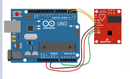

# Arduino ECG

An Arduino-based electrocardiograph (ECG) that uses SparkFun's AD8232 chip.

## Description

An electrocardiogram is a medical tool used to diagnose a variety of heart conditions by measuring electrical impulses originating from the heart. 

This Arduino-based ECG can receive and visualize the electrical data in real time, as well as save it for later use. 

## Getting Started

### Dependencies

This program has been tested and created using Python 3.10 on Windows 10. It may or may not work on earlier versions of Windows, or on other operating systems. 

Libraries required:
* Matplotlib
* Scipy
* Pandas
* Pyserial

### Connecting the wires

Connect the AD8232 chip to the Arduino UNO board as shown below: \

### Connecting the victims

Connect the victims to the Arduino UNO board in either of these configurations:\

### Running the code

Before running the code, change `port` to the port to which your Arduino UNO board is connected. 

When running the program, it will begin by displaying a graph of the electrical impulses in real time. When the window containing the graph is closed, a second graph with all the collected and filtered data points will appear. When this second graph is closed, the raw csv data and the second graph will be saved to the specified file path if `save_data` is set to `True`. This path can be modified by changing the variables `filepath_csv` and `filepath_img`. They are set to save in the current working directory by default.

If `is_test` is set to `True`, the program will generate and use fake, linear data. This can be used to test the code without setting up the hardware.

## Authors

Created by Syphax Ramdani and Shawn Maor, with the collaboration of Joel Trudeau.

## Acknowledgments

Many thanks to Dawson College and the S.P.A.C.E initiative for allowing us the opportunity to work on this project.

Additional thanks to the following guides:
* [Instructables Tutorial by Peter Balch](https://www.instructables.com/ECG-Display-With-Arduino/)
* [SparkFun Guide](https://learn.sparkfun.com/tutorials/ad8232-heart-rate-monitor-hookup-guide/all)
